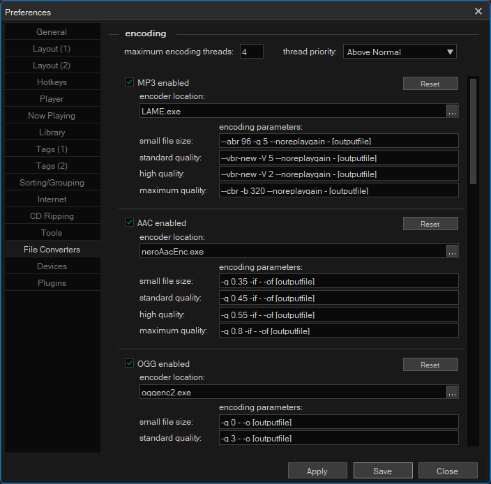

# musicbee-audio-encoder-pack
 A pack of audio encoders that can be used with MusicBee.

# Installation
1. Download zip from [releases](https://github.com/drequeary/musicbee-audio-encoder-pack/releases).
2. Extract and put encoders in a musicbee folder in a folder called Codec.
3. Go to File -> Edit Preferences -> File Converters.
4. Under encoder location, select the exe file for the choosen encoder.

## Note
These encoders are old and you should probabaly look for updated versions online.